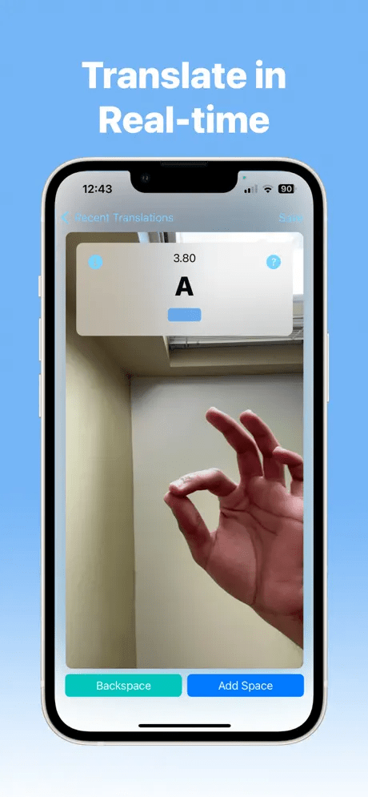

# MorseTalk 
### Download our app on [App Store](https://apps.apple.com/us/app/morsetalk-immerse-in-morse/id6447790090/).

## About the Project

A fun new way to learn Morse Code!

MorseTalk is an engaging and interactive way to learn Morse Code. Convert your hand gestures into Morse Code and English!

## Views

| Quick Tips | Tutorial | Real-Time View | Save Translations |
|:----:|:----:|:----:|:----:|
|| |  | |
